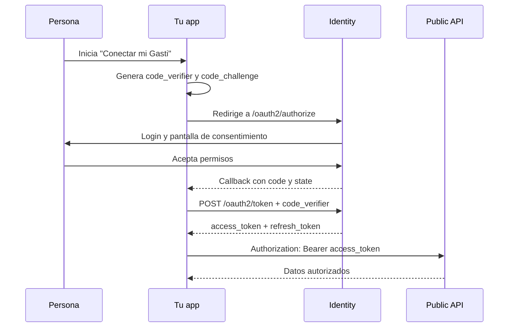

## Authorization Code + PKCE

Gasti usa un Authorization Server OAuth 2.1 en Identity. El flujo entrega un código de corta duración en el callback; los tokens se obtienen después desde el endpoint de token.

| Dato | Valor |
| --- | --- |
| Authorization Server | `https://identity.api.gasti.pro` |
| Issuer | `https://identity.api.gasti.pro/api/auth` |
| Discovery | `https://identity.api.gasti.pro/.well-known/oauth-authorization-server` |
| Discovery alternativo | `https://identity.api.gasti.pro/.well-known/oauth-authorization-server/api/auth` |
| JWKS | `https://identity.api.gasti.pro/api/auth/jwks` |
| Grant types | `authorization_code`, `refresh_token` |
| PKCE | S256 obligatorio para clientes públicos |

<Note>
No existe el grant `client_credentials`: el acceso representa el consentimiento de una persona, no el de una aplicación sin usuario.
</Note>

## Secuencia

## Endpoints

<CardGroup cols={2}>
  <Card title="Discovery" icon="magnifying-glass">
    `GET https://identity.api.gasti.pro/.well-known/oauth-authorization-server`
  </Card>
  <Card title="Authorize" icon="arrow-up-right-from-square">
    `GET https://identity.api.gasti.pro/api/auth/oauth2/authorize`
  </Card>
  <Card title="Token" icon="key">
    `POST https://identity.api.gasti.pro/api/auth/oauth2/token`
  </Card>
  <Card title="UserInfo" icon="user">
    `GET https://identity.api.gasti.pro/api/auth/oauth2/userinfo`
  </Card>
</CardGroup>

## Reglas importantes

- El callback recibe solamente `code` y `state`.
- Validá `state` antes de intercambiar el código para evitar aceptar respuestas de otra sesión.
- Usá el mismo `redirect_uri` en autorización y token.
- Enviá `resource=https://api.public.gasti.pro` cuando pidas un token para la Public API.
- Guardá los tokens en el servidor o en el almacenamiento seguro de tu aplicación; no los expongas en logs.
